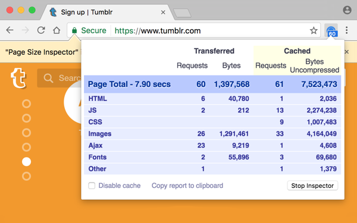

Page Size Inspector
===================

Page Size Inspector is a Chrome extension that reports page size, cache usage,
network requests, load time in a convenient way.

Install from [Chrome Store](https://chrome.google.com/webstore/detail/oepnndnpjiahgkljgbohnnccmokgcoln)

Architecture
------------

- Vanilla JS, no jQuery or other libs being used. (This is Chrome only, after
  all.)
- Tiny and fast [monkberry](http://monkberry.js.org) UI virtual DOM lib used for templating.
- Uses the [chrome.debugger API](https://developer.chrome.com/extensions/debugger) to collect request data, as [chrome.webRequest](https://developer.chrome.com/extensions/webRequest) was inadequate. And chrome.debugger is the only API with solid "Disable cache" logic.
- Does not consume any resources while inactive.

Build steps
-----------

A home made simple python make script takes care of 3 tasks.

To make a release, a zip package containing necessary files:

    python make.py release

To compile Monkberry templates: (first install Monkberry compiler with
"npm install monkberry -g")

    python make.py compile

To test the popup locally with test data:

    python make.py www

Other extensions
----------------

I have developed also two other open-source Chrome extensions
[Quick source viewer](https://github.com/tomimick/chrome-ext-view-src) and
[Save CSS](https://github.com/tomimick/chrome-ext-save-css).

Feedback
--------

Send feedback to author [Tomi Mickelsson](mailto:tomi.mickelsson@iki.fi).
Enter praise in the [Chrome Store](https://chrome.google.com/webstore/detail/oepnndnpjiahgkljgbohnnccmokgcoln) :)

